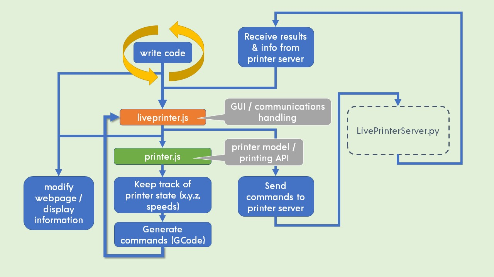
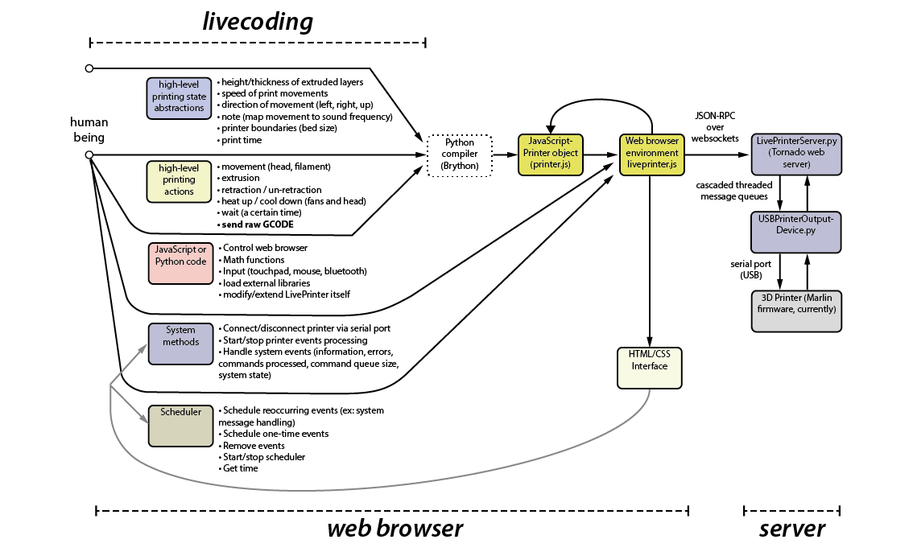

# LivePrinter: Livecoding meets 3D printing

*Experiments in live computational sculpting*

LivePrinter is an open source system for live, intuitive, immediate drawing and fabrication with 3D printers. It allows people to directly draw shapes, lines, and complex objects using only code. The system serves as an introduction to the basics of 3D printing, as well as platform for experimenting with new techniques that are not allowed by current software. It also allows users to create physical forms using different functions that take into account physical properties like speed and temperature, instead of the usual visual modelling techniques. As a live performance system, LivePrinter blends mechanical music, sculpture and moving image together. It allows musical concepts and visual aesthetics to directly influence digital manufacturing toolpaths and vice versa. It demonstrates a possible future path where humans play a direct, creatively-rewarding part in a system of semi-automated, digital manufacturing.

## Getting involved

There's a forum on https://talk.lurk.org/channel/liveprinter

You can [join our email list](http://pixelist.info/liveprinter-email-list/) to keep up to date with performances, demonstrations, workshops, and important updates.

Evan is on Twitter at **@evanraskob** and can answer questions, etc.

We can create a Reddit forum or YouTube channel if there is demand for it.

## Installing and Running

~~[A quickstart document can be found here](https://www.odrive.com/s/80d3d8b4-096c-4c67-a71a-3e0c29273701-5c826d80)~~ -- this needs an update! It is fairly out of date.

The server front-end is coded in JavaScript using NodeJS's npm build system. You will need to compile it first (or [download a pre-compiled release](https://github.com/pixelpusher/liveprinter/releases)) so download and unzip the project using the link in the above right. Then, in your project folder, open a command prompt. Make sure you have npm installed.

1. Run ```npm install``` to install required modules
    - On OS X, it's recommended to use the 'official' NodeJS from [https://nodejs.org/en/download/](https://nodejs.org/en/download/) instead of brew because there might be an error with building node-gyp. Then, when nodejs is installed, install node-gyp using `sudo npm install node-gyp -g` _before_ running `npm install.` 
    - On Ubuntu or linux, you'll probably need to set up your serial port permissions using ``sudo usermod -a -G tty $USERNAME`` and ``sudo usermod -a -G dialout $USERNAME`` first before running the server (you might need to reboot your machine after this to see the changes). Then assuming you are on ``/dev/ttyACM0`` try running ``echo "G28" > /dev/ttyACM0`` in your terminal once connected via USB (check for your serial port using ``dmesg``) to run a standard bed leveling GCode and see if anything happens. Then, unplug and re-plug your printer usb and start the server.      
2. For production, build streamlined javascript by running ```npm run watch``` (for some reason, build doesn't always work but watch does) and following the instructions below to get the python server up and running.
3. For development, run ```npm run watch``` to have any saved changed automatically re-compiled.
4. Open a second terminal and run `npm run server` to run the server, or

The web server (tornado 6) runs on Python 3 (3.6, 3.7 and 3.8+ tested) so you will need that installed.  Then, use pip (the Python package manager) to install supporting libraries `python3 -m pip install pyserial tornado tornado-jsonrpc2`:

* pyserial (tested with 3.4+)
* tornado (tested with 6.0.1+)
* tornado-jsonrpc2 (tested with 0.5+)

Run the server using your Python environment of choice. The server script is in the ``liveprinter`` subfolder and is called ```LivePrinterServer.py```, so change to that folder using `cd liveprinter`, make sure there's a `logs` folder (create it, or on Linux/OS X in terminal type `mkdir logs`) and run:

```python LivePrinterServer.py```

By default, the server runs on port 8888 so open a web browser to <http://localhost:8888> (or [change it](https://github.com/pixelpusher/liveprinter/blob/master/liveprinter/LivePrinterServer.py#L28)).  It can be run without an actual 3D printer using a "fake" serial port, check the videos or look for the _dummy_ printer in the drop down menu when you've got it running.

Here is a short (old!) video demonstrating the python installation on Windows (on OS X it's the same, just use Terminal instead of Command Prompt):
https://youtu.be/ejlaQhOCUHw


### Troubleshooting

If anything weird happens like line numbers getting out of sync, try unplugging the printer, kill the server, and reload.

Otherwise, often just disconnecting in the interface works fine.

For Prusa printers, make sure your serial baud rate is 115200 *before* you select the serial port; for other Marling printers it might be that, or 57600, or the Ultimaker 2 default of 250000.

## Using LivePrinter

A short video to get up and running in 2 minutes (assuming you've plugged your printer into your computer via USB and turned it on!)

[](https://www.youtube.com/watch?v=jdqrpgFGCgc)

Try these [instructions for using the livecoding editor and controlling the printer](reference/Quickstart.md).

## About

LivePrinter is an open source system for live, immediate drawing and fabrication with 3D printers.  It’s particularly useful for:

* Textile artists who want to print onto fabrics and make new shapes and textures; for artists who want to use a printer like a 3D plotter and draw new forms
* Product and industrial designers who want to understand more about how 3D printing works and fine-tune their materials and tool paths
* Materials scientists who want to study 3D printing materials in more controlled, repeatable ways
* Computational and computer artists, either looking for new tools or making generative works
* Educators who teach fabrication
* HackSpace and MakerSpace staff who need more tools to fine-tune their machines

LivePrinter combines the design and 3D printing of objects into a single, iterative process. Livecoding is used to control manufacturing precisely and procedurally with real-time flexibility. It brings improvisation and intuition to the act of making new computational forms. The system extends digital printing and CNC machining into the realm of performance and also has potential in design and science pedagogy.

The current software toolchains of 3D printing place the artist and designer at a difficult distance from the physical process of making.  There is little space for live improvisation and experimentation, especially with key properties that directly affect printing materials, like temperature and print speeds.

You can watch a video of LivePrinter in action, running experimental tests, creating generative shapes, and exploring printing in air:
[](https://www.youtube.com/watch?v=POwENjC6qO4&list=PLuA35183Y-6-GB69A7t3pcTRx6nrI7QxO&index=5)

## Design Principles

LivePrinter is designed to be:

* *Flexible in deployment:* it should run on as many platforms as possible (Raspberry PI and other Linux and RTOS systems as well as standard computers such as desktops and laptops)
* *Easy to hack:* the system architecture itself should not have too many dependencies or be generally too elaborate and complex.  It should stick to minimal, necessary features. It should favor less code files that do more over many files that interact in complex ways.  Important code that will edited often should be foregrounded.  This goes for the livecoding mini-languages as well.
* *Allow for as little lag as possible:* physically making things happens in realtime, and even milliseconds count when you have melted plastic cooling.
* *Be quick and intuitive to code:* the livecoding system should be as minimally-verbose as possible so it can be typed quickly. It should also provide enough core, useful functions so that common making actions are supported.
* *Be as honest as possible with physical states:* the code should not try and cache physical properties like temperature and print head position, for example.  These relate to _instantaneous reality_ and should be treated as such.  A query/response system is one such solution.  
* *Be understandable and appropriate for artists, designers, and non-technical people:* This is a (fun!) tool for making intuitively, and the language should reflect that, even at the expense of technical accuracy (of language).
* *Be collaborative, social, performative:* Allow for others to take part in the making process, whether that's contributing directly to the livecoding or spectating as audience.

## How It Works / Developing

*Overview of the system:*


LivePrinter is part web client and server for livecoding and part 3D printer host application on the back end.  On the front end, a user will livecode in a web browser (or other web client).  Their code is compiled into machine-appropriate G-Code, packaged into JSON-ROPC calls and sent via AJAX (http) to the back end, where it is sent to the printer via a serial connection.  Responses from the printer are sent back to the web client. This whole process is asynchronous, for speed and for tracking which messages successfully were send (and responses received).  

More than one person might be involved: the system is designed to support collaborative livecoding and potentially many 3D printers, as complex as that is! (Look at the Max/MSP example in the *misc* folder for an example of this)

## JSON-RPC API

### Testing

If you fire up the server and then navigate a browser to http://localhost:8888/jsontest you can play with the API in a hands-on web page.

### API Documentation

This is what the API looks like, currently:

#### get list of serial ports

* **send (no params):** { "jsonrpc": "2.0", "id": 6, "method": "get-serial-ports","params": []}
* **receive back array of port names:** {"jsonrpc":"2.0","id":6,"result":{"ports":["COM3","dummy"],"time":1568371926204.6528}}

#### set printer serial port and connection speed
* **send parameters array with port name (e.g. "COM3") and speed (e.g. 25000):** { "jsonrpc": "2.0", "id": 5, "method": "set-serial-port","params": [ "COM3", 250000]}
* **receive back connection results from printer (if any):** {"jsonrpc":"2.0","id":5,"result":[{"time":1568375167280.751,"port":["COM3",250000],"messages":["start","echo:Marlin 1.0.0","echo: Last Updated: Dec 8 2018 13:25:37 | Author: Version DEV","Compiled: Dec 8 2018","echo: Free Memory: 2123 PlannerBufferBytes: 1232","echo:Stored settings retrieved","echo:Steps per unit:","echo: M92 X80.00 Y80.00 Z200.00 E282.00","echo:Maximum feedrates (mm/s):","echo: M203 X300.00 Y300.00 Z40.00 E45.00","echo:Maximum Acceleration (mm/s2):","echo: M201 X9000 Y9000 Z100 E10000","echo:Acceleration: S=acceleration, T=retract acceleration","echo: M204 S3000.00 T3000.00","echo:Advanced variables: S=Min feedrate (mm/s), T=Min travel feedrate (mm/s), B=minimum segment time (ms), X=maximum XY jerk (mm/s), Z=maximum Z jerk (mm/s), E=maximum E jerk (mm/s)","echo: M205 S0.00 T0.00 B20000 X20.00 Z0.40 E5.00","echo:Home offset (mm):","echo: M206 X0.00 Y0.00 Z-12.15","echo:PID settings:","echo: M301 P10.00 I2.50 D100.00"]}]}

#### send arbitrary GCODE (must be connected first otherwise get exception back)

* **send any line of GCode (e.g. "G28") in the parameters as a string. NOTE: only send one command so you receive the proper response for that command. For multiple commands, send multiple jsonrpc requests:** { "jsonrpc": "2.0", "id": 4, "method": "send-gcode","params": ["G28"]}
* **receive back results from printer (e.g. "ok")**: {"jsonrpc":"2.0","id":4,"result":["ok"]}

#### get printer connection state (port name and state e.g. closed or connected)

* **send:** { "jsonrpc": "2.0", "id": 3, "method": "get-printer-state","params": []}
* **receive back:** {"jsonrpc":"2.0","id":3,"result":[{"time":1568371930335.6362,"port":null,"state":"closed"}]} **or** {"jsonrpc":"2.0","id":3,"result":[{"time":1571916551445.2378,"port":"/dev/null","state":"connected"}]}

#### close printer serial port

* **send (no params):** { "jsonrpc": "2.0", "id": 2, "method": "close-serial-port","params": []}
* **receive back:** {"jsonrpc":"2.0","id":2,"result":["closed"]}

### Key files

* **liveprinter.js**: handles the user interface and communication with server (sends GCode, handles events)
* **printer.js**: the 3D printer API (outputs GCode to be sent to the printer)
* **LivePrinterServer.py**: The back-end web server (uses tornado and websockets), implements the JSON-RPC API
* **USBPrinterOutputDevice.py**: the Marlin driver that handles serial communication

The back-end web server and websockets service uses a Tornado server written in Python and a very-adapted version of [Cura's 3D printing driver](https://github.com/Ultimaker/Cura/tree/master/plugins/USBPrinting) that connects to a [Marlin Firmware](https://github.com/MarlinFirmware/Marlin) based 3D printer (currently tested on an [Ultimaker 2+](https://github.com/Ultimaker/Ultimaker2Marlin)) and on various Prusa printers, as well as homebrew Marlin-based ones.  

*A more complicated architecture diagram:*


### Getting Involved / Contributing

If you want to get involved, please give us a shout!  The more the better.

There is [an API and function reference for the client end](https://pixelpusher.github.io/liveprinter/docs/) which needs formatting work.

### An aside on Python Virtual Environments

It makes sense (in general, not just for this project) to do Python development using isolated [virtual environments](https://docs.python.org/3/library/venv.html#venv-def), to prevent contamination or clashes between modules and utilities by keeping all configuration sandboxed. Check the docs to see how to isntall a virtual environment for your OS, but on OS X and Linux its:
```bash
cd LIVEPRINTER_MAIN_FOLDER
cd liveprinter
python3 -m venv ./venv

# create a Python 3 virtual environment
source ./venv/bin/activate
# activate the environment
pip install --upgrade pip
# get the latest pip in the virtual environment (probably not essential)
pip install tornado pyserial tornado_jsonrpc2
# get the libraries we need
python LivePrinterServer.py
        # launch the server in the Python 3 sandbox  
```

Then when all is done:

```shell
deactivate
# wind down the environment
```

## License and Dependencies

LivePrinter is completely open source (AGPL 3.0). To summarise, it is built on and inspired by other open source projects:

* [Python](http://python.org)
* [Tornado web server](https://github.com/tornadoweb/tornado/)
* [Cura 3D printing software](https://github.com/Ultimaker/Cura/)
* [Marlin Firmware](https://github.com/MarlinFirmware/Marlin)
* [Ultimaker 2 Marlin variant](https://github.com/Ultimaker/Ultimaker2Marlin)
* Bottleneck async limiter](https://github.com/SGrondin/bottleneck)
* bits of [CNCjs](https://cnc.js.org/)

## Similar Projects

* [OpenGB](https://github.com/amorphitec/opengb) has been an inspiration
* [Fabrica](https://github.com/arthurwolf/fabrica), a front-end for [Smoothieware](https://github.com/Smoothieware/Smoothieware) looks interesting.  Smoothieware integration might be nice, someday.

## Who is behind this

This project was started by [Evan Raskob](http://pixelist.info), [artist, livecoder and Lecturer at Goldsmiths University](https://www.youtube.com/playlist?list=PLuA35183Y-6-kdqw70KCm4knSm4lvvicu) (previously  at the Royal College of Art in London), and part-time PhD student in arts and Computational Technology also at Goldsmiths.  This project is the main practice part of his ongoing PhD study.  If you'd like to get in touch, please email him at e.raskob@gold.ac.uk.
